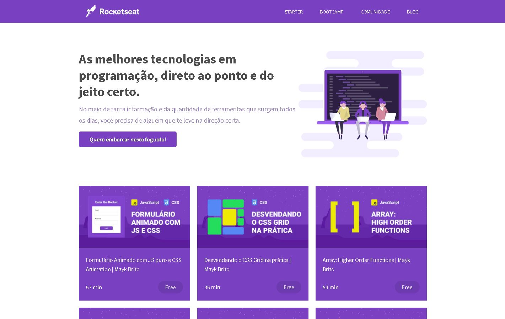

# Clone Site Rocketseat

Foi refatorado o código CSS de uma das aulas de responsividade do Maik Brito utilizando o pré-processador SASS. 

;

## Tecnologias utilizadas 

- HTML
- CSS
- SASS
- JAVASCRIPT
